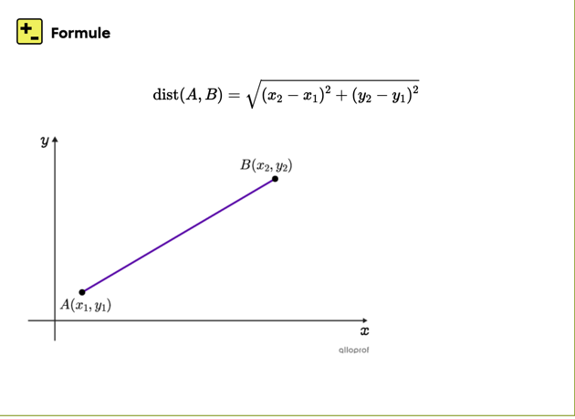

# Exercice 01 : Les structures
Il est demandé de réaliser un programme qui modélise des points dans un plan en utilisant les structures Il faut respecter les spécifications suivantes :
1. Définir une structure Point avec les attributs suivants :

    - _X : entier (coordonnée sur l'axe des abscisses),_
    - _Y : entier (coordonnée sur l'axe des ordonnées)._
    - Implémenter un constructeur pour initialiser les coordonnées d’un point.
    
   

2. Ajouter les méthodes suivantes :

   - Distance(Point autrePoint) : retourne la distance entre le point actuel et un autre.
   - Déplacer(int deltaX, int deltaY) : déplace le point en ajoutant deltaX à X et deltaY à Y.
   - Afficher() : affiche les coordonnées du point au format (X, Y).

3. Dans le programme principal :

   - Créer deux points et afficher leurs coordonnées,
   - Calculer et afficher la distance entre les deux points,
   - Déplacer un point et afficher les nouvelles coordonnées.