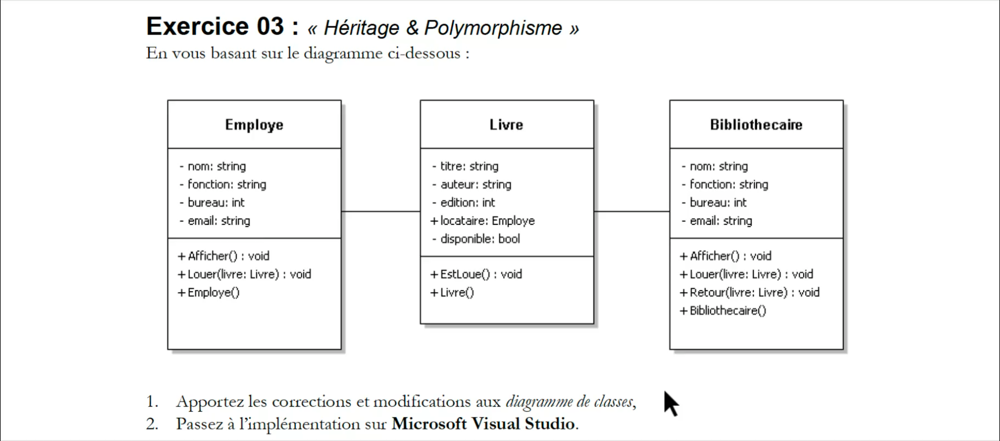

# Exercice 03 : « Héritage & Polymorphisme »
En vous basant sur le diagramme ci-dessous :

1. Apportez les corrections et modifications aux diagramme de classes,
2. Passez à l’implémentation sur Microsoft Visual Studio.