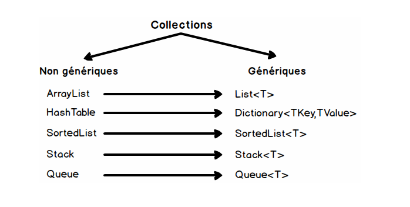

# Collections In C#

Les collections sont des classes spécialisées pour le stockage et la récupération de données. Ces classes prennent en charge les piles, les files, les listes et les tables de hachage. 
La plupart des classes de collection implémentent les mêmes interfaces.

